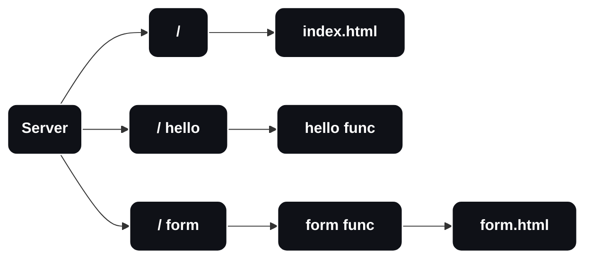

***I create this server to refresh my Golang knowledge!***

```mermaid
flowchart LR
    Server("<b>Server</b>") --> Root["<b>/</b>"]
    Server --> Hello["<b>/ hello</b>"]
    Server --> Form["<b>/ form</b>"]

    Root --> Index["<b>index.html</b>"]
    Hello --> HelloFunc["<b>hello func</b>"]
    Form --> FormFunc["<b>form func</b>"]
    FormFunc --> FormHtml["<b>form.html</b>"]

    %% Koyu Tema ve Yuvarlatılmış Kenar Stilleri
    classDef darkBox fill:#0f1117,stroke:#ffffff,stroke-width:1.5px,color:#ffffff,rx:10,ry:10;
    class Server,Root,Hello,Form,Index,HelloFunc,FormFunc,FormHtml darkBox;
```
